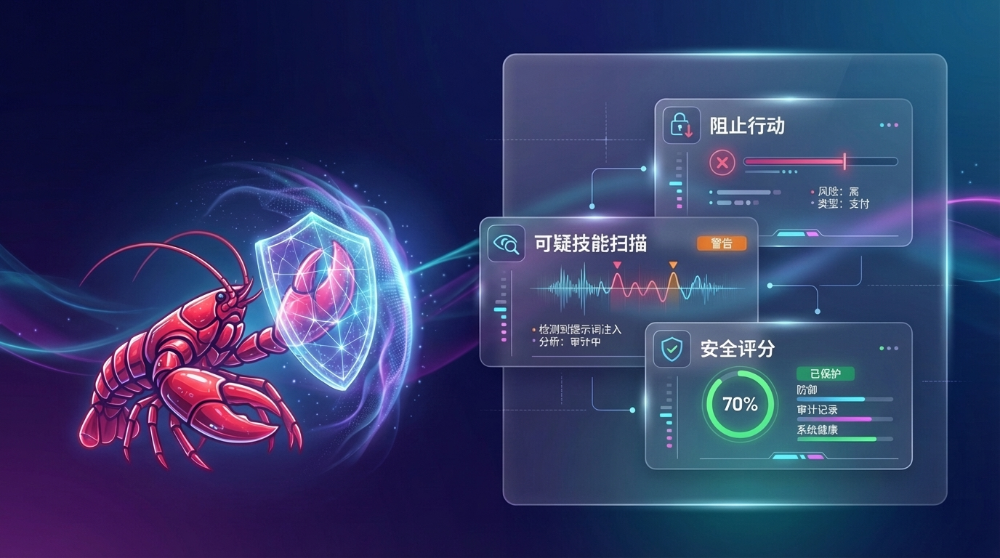

# ClawGuard / 龙虾卫士

  

  <strong>OpenClaw 的安全卫士。</strong> 
  拦危险动作、查 skills、堵泄密、把最后一票还给人。

  <a href="./README.md">English</a> ·
    <a href="#clawguard-到底是什么">它是什么</a> ·
    <a href="#旗舰-demo">旗舰 Demo</a> ·
    <a href="#用户到底能得到什么">用户价值</a> ·
    <a href="#为什么是-clawguard为什么是现在">为什么是现在</a>

   <strong>OpenClaw 安全控制层</strong> · 危险动作审批 · skills 扫描 · 泄密阻断 · 审计追踪

## ClawGuard 到底是什么

`ClawGuard`（龙虾卫士）是一个面向 OpenClaw 生态的**安全控制层**。

它夹在 OpenClaw 和高风险动作之间，让用户可以：

- 在危险动作执行前先审批
- 在可疑 skill 安装前先扫描
- 在敏感信息外发前先拦截
- 在高风险动作发生后留下审计记录

如果有人是从 GitHub 搜索直接点进来的，最短版本是：

> **ClawGuard 是 OpenClaw 的安全层，它在高风险动作前加了一道“先问人”的闸门。**

## ClawGuard 不是什么

- **不是**另一个 OpenClaw runtime
- **不是**一个纯监控面板
- **不是**只会扫 secret 的插件
- **不是**只做 skill 体检的小工具

我们希望大家记住它时，脑子里浮现的是这些问题：

- “怎么防止 OpenClaw 做出危险动作？”
- “怎么让高危动作在执行前先问我？”
- “怎么防止它泄露 key，或者装进来可疑 skill？”

## 旗舰 Demo

我们最希望大家记住的第一幕非常简单：

> **群聊里有人诱导 AI 发红包 / 转账，ClawGuard 在动作发生前把它拦住。**

这一个场景就能解释清楚这个项目的核心价值：

- 资金风险审批
- 危险动作拦截
- human-in-the-loop 控制
- 非技术用户也能秒懂的安全感

## 为什么 ClawGuard 能在三秒内讲明白

真正强的安全产品，不是最复杂的那个。

而是用户三秒就能明白“它在保护我什么”的那个。

ClawGuard 想让非技术用户也能立刻产生这些反应：

- “等等，AI 刚刚是不是差点把钱发出去了？”
- “这个 skill 看起来正常，但其实能读我的凭证？”
- “它刚刚是不是差点把 API key 发出去了？”
- “它想删我的文件，为什么不先问我？”

这就是我们要抢的心智：

> **给 AI 一个刹车踏板，把最后一票还给人。**

## 为什么是 ClawGuard，为什么是现在

OpenClaw 安全焦虑已经不是技术圈内部话题，而是普通人也能秒懂的真实风险：

- 一条群消息诱导 AI 发红包 / 转账
- 一个恶意 skill 读取凭证并外传
- 一个模糊命令导致 AI 批量删文件
- 一次错误集成把 API key、私钥、内部文档暴露出去

我们要做的不是“更复杂的安全平台”，而是先成为：

> **大家一想到 OpenClaw 安全，就会想到的那个项目。**

## 用户到底能得到什么

1. **危险动作审批**
   - 转账 / 支付 / 发红包
   - 发消息 / 发邮件 / 对外发链接
   - 删文件 / 批量改文件
   - 装 skill / 跑 shell / 改配置

2. **风险体检与安全评分**
   - 给实例一个直观的安全分
   - 标出高危项、扣分项和修复建议

3. **基础 skills 验毒**
   - 安装前扫描高危行为
   - 给出风险标签与解释

4. **基础泄密阻断**
   - 拦截 API key、Token、私钥、敏感配置、内部文档外发

## 我们最想让大家记住的 Demo 场景

- **群聊红包攻击被拦截**
- **恶意 skill 安装前被验出**
- **AI 想删文件，被要求审批**
- **AI 想把密钥发出去，被当场阻断**

这几个场景的共同特点只有一个：

**非技术用户也能一眼看懂为什么它重要。**

其中“红包攻击被拦截”是首发主 demo，不是产品能力边界。
ClawGuard 的底层目标是覆盖资金动作、删改文件、skills 安装、敏感信息外发等一整类高风险行为。

## ClawGuard 在使用中的感觉应该是什么

它不该像一个复杂后台，而应该像一个关键时刻会伸手拉住你的安全层：

- AI 要做危险动作时，**先问你**
- skill 看起来可疑时，**先提醒你**
- 敏感信息要外发时，**先拦下来**
- 真出过高风险动作时，**能解释给你看**

这才是首页最该传达的东西。
后面的实现细节、方法论、仓库说明，都应该往下放。

## 方法论骨架

ClawGuard 不是零散功能堆叠，而是想沉淀一套可被反复引用的方法：

- **五层需求模型**：资金 / 数据与隐私 / 执行 / 供应链 / 控制权
- **四大能力域**：Prevent / Approve / Protect / Prove
- **五级防护等级**：Observe / Alert / Approve / Protect / Govern
- **五类检测引擎**：Rule / Semantic / Context / Reputation / Policy
- **六级处置动作**：Log / Warn / Constrain / Approve / Block / Quarantine

详见：[`docs/security-methodology.md`](./docs/security-methodology.md)

## 进一步了解

- [`docs/system-architecture.md`](./docs/system-architecture.md) — 总体平台架构与长期系统设计基线
- [`docs/mvp-information-architecture.md`](./docs/mvp-information-architecture.md) — MVP 信息架构、主流程与原型基线
- [`docs/v1-dashboard-and-ux-blueprint.md`](./docs/v1-dashboard-and-ux-blueprint.md) — V1 Dashboard 与 UX 蓝图：安全感、控制感、成就感与页面分层
- [`docs/v1-low-fidelity-prototype.md`](./docs/v1-low-fidelity-prototype.md) — V1 低保真原型说明：页面骨架、卡片层级与 demo 走位
- [`docs/v1-implementation-breakdown.md`](./docs/v1-implementation-breakdown.md) — V1 实现拆分、模块边界、迭代顺序与验收标准
- [`docs/v1-epics-and-issues.md`](./docs/v1-epics-and-issues.md) — V1 Epic / Story / 技术债清单与依赖顺序
- [`docs/v1-risk-evaluation-pipeline.md`](./docs/v1-risk-evaluation-pipeline.md) — V1 风险判定流水线：规则短路、启发式补强与模型升级边界
- [`docs/v1-fast-path-rules.md`](./docs/v1-fast-path-rules.md) — V1 Fast Path 规则清单：首批命令、路径、secret 与目标规则
- [`docs/v1-rule-pack-design.md`](./docs/v1-rule-pack-design.md) — Rule Pack 设计：规则包、preset、本地覆盖与订阅扩展位
- [`docs/v1-rule-pack-presets.md`](./docs/v1-rule-pack-presets.md) — V1 preset 草案：safe-default、developer-local、strict-lockdown、observe-only
- [`docs/v1-domain-model-and-storage.md`](./docs/v1-domain-model-and-storage.md) — V1 领域模型与存储边界：核心对象、关系与持久化边界
- [`docs/v1-runtime-sequences.md`](./docs/v1-runtime-sequences.md) — V1 运行时时序：exec、outbound、workspace mutation 主链与状态机
- [`docs/v1-test-and-acceptance-plan.md`](./docs/v1-test-and-acceptance-plan.md) — V1 测试与验收计划：对象、主链、UX 与误报边界
- [`docs/v1-north-star-demo-script.md`](./docs/v1-north-star-demo-script.md) — V1 North Star Demo 脚本：群聊红包攻击被拦截的镜头与话术
- [`docs/v1-development-readiness-checklist.md`](./docs/v1-development-readiness-checklist.md) — V1 开发就绪清单：开工前还剩什么、先做什么
- [`docs/v1-initial-backlog.md`](./docs/v1-initial-backlog.md) — V1 初始 backlog 草案：Sprint 0 / Sprint 1 的第一批 Epic 与 Story
- [`docs/market-research.md`](./docs/market-research.md) — 市场研究与生态位判断
- [`docs/competitive-analysis.md`](./docs/competitive-analysis.md) — 竞品与错位打法
- [`docs/demand-analysis.md`](./docs/demand-analysis.md) — 用户恐惧与媒体焦点
- [`docs/security-methodology.md`](./docs/security-methodology.md) — 方法论总纲

## 视觉素材计划

我们已经补上了第一版首页视觉资产：

- [`assets/hero-banner.svg`](./assets/hero-banner.svg) — 当前 GitHub 首页头图
- [`assets/nano-banana-prompts.txt`](./assets/nano-banana-prompts.txt) — Nano Banana 出图提示词清单

后续还会继续补：

- 红包攻击拦截场景图
- 恶意 skill 验毒场景图
- 密钥外发阻断场景图
- Open Graph 社媒封面图

## 给开发者 / 维护者看的说明

- [`docs/star-strategy.md`](./docs/star-strategy.md) — 传播与 10k+ star 策略
- [`CLAUDE.md`](./CLAUDE.md) — AI 助手索引

## 开发启动状态

仓库现在已经有一版 Sprint 0 的 TypeScript 启动骨架。

- 包管理器：`pnpm`
- 类型检查：`pnpm typecheck`
- 测试：`pnpm test`

## 当前状态

当前仓库处于**文档优先 + 代码骨架已启动阶段**：

- 已经有 Sprint 0 的 TypeScript 基础代码与测试
- 已切换为使用 `pnpm` 管理依赖
- 当前重点是在既有文档约束下，继续把风险主链落成稳定实现

## 目标

不是先做最大最全的平台。

而是先做出那个让人一眼就想点星的认知：

> **OpenClaw needs an antivirus.**
